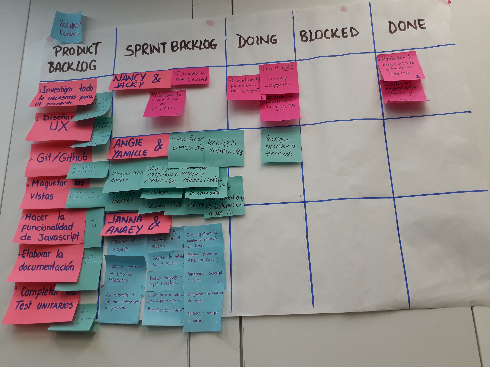
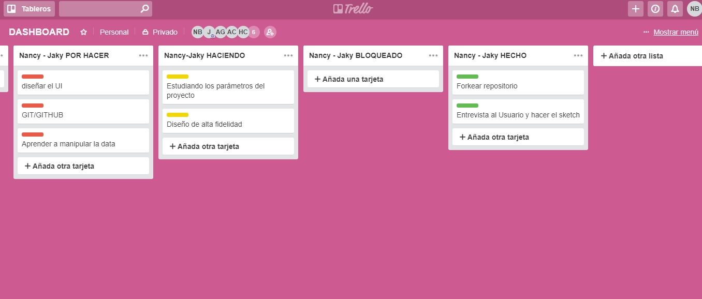
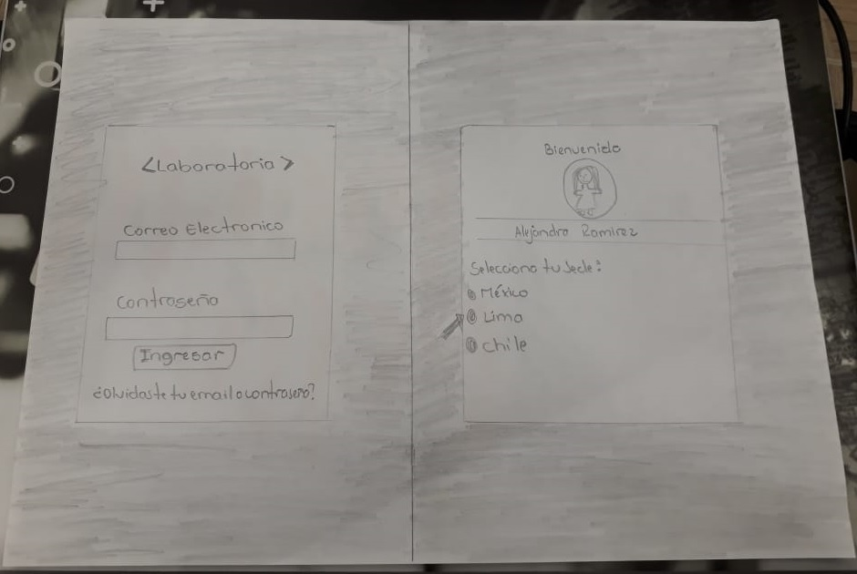
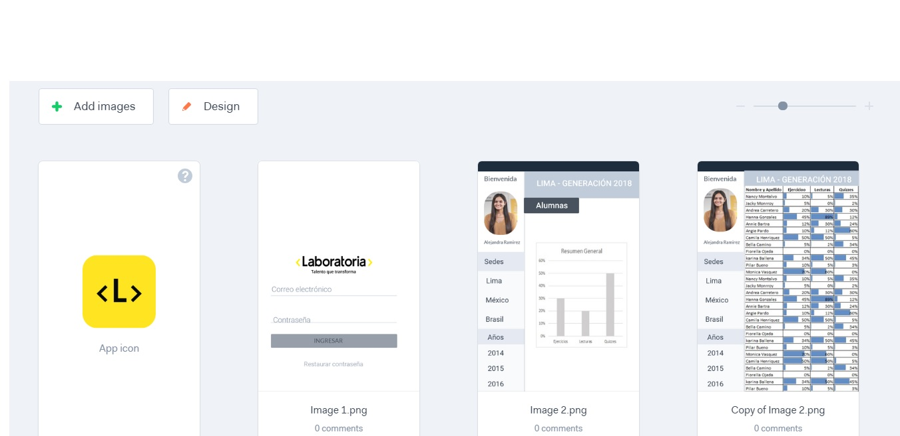
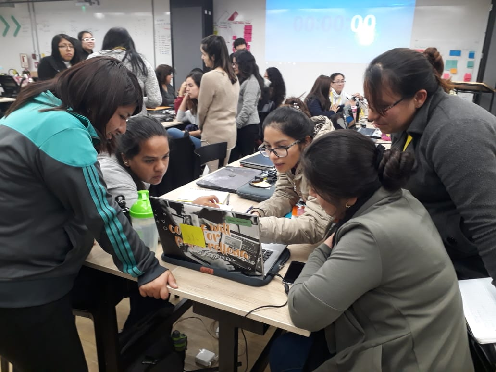
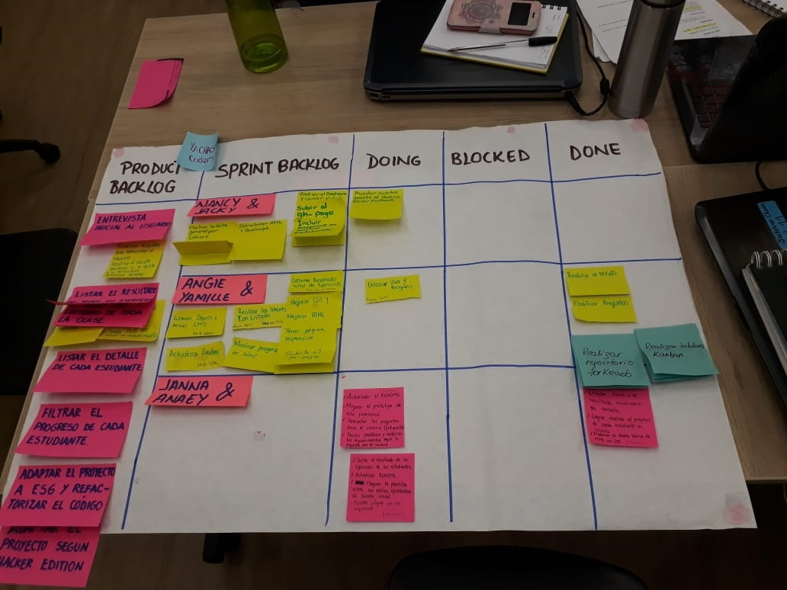

# Proyecto 2: DATA DASHBOARD

## Preámbulo
En laboratoria 

### Introducción
En Laboratoria, las Training Managers (TMs) hacen un gran trabajo al analizar la mayor cantidad de datos posibles respecto al progreso de las estudiantes para apoyarlas en su aprendizaje.

La principal medida de progreso de una estudiante en Laboratoria es su avance completando los proyectos de la Ruta de Aprendizaje y su desempeño en función a la Rúbrica de Niveles Esperados. Sin embargo, para completar estos proyectos las estudiantes acceden a contenidos de aprendizaje (lecturas, videos, ejercicios y quizzes) en un sistema que llamamos LMS (Learning Management System). El LMS acumula data sobre quién leyó qué, qué ejercicios se han completado, los resultados de los quizzes, etc.

A pesar de que la data de progreso del LMS (ej. lecturas leídas, ejercicios completados, nota en quizzes, etc.) no impacta directamente en la evaluación de una estudiante, sí es una pieza de información relevante que las TMs quisieran visualizar para tener un mejor entendimiento de cómo va cada estudiante en su proceso de aprendizaje.

Así, el reto de este proyecto es crear una interfaz donde las TMs puedan ver y usar la data de progreso del LMS. Para ello, proponemos crear un data dashboard (tablero de visualización de datos).

### Proceso de planificación
Para realizar la planificación del proyecto, se utilizó un tablero Backlog y un planificador online en la plataforma Trello.
La planificación se reliza cada vez que termina un sprint.

## Objetivos 
El objetivo principal de este proyecto es crear una herramienta web que permita a las Training Managers de Laboratoria verificar el progreso de cada una de las estudiantes mediante la dashboard de una manera fácil y rápida,  permitiendo así optimizar sus tiempos a la hora de  visualizar todos los datos posibles respecto al desempeño de las estudiantes para apoyarlas en su aprendizaje. 

### Product backlog

### Trello

### Proceso de planeamiento del proyecto

### Entrevista al usuario
1. ¿Quiénes son los principales usuarios de producto?
    Nuestros principales usuarios son las Training Managers.

2. ¿Cuáles son los objetivos de estos usuarios en relación con el producto?
    El objetivo principal es hacer un seguimiento a cada uno de nuestras alumnas.

3. ¿Cuáles son los datos más relevantes que quieren ver en la interfaz y por qué. Cómo los descubriste?
    Los datos mas relevantes son los quizzes.

4. ¿Cuándo revisan normalmente estos datos los usuarios?
    Normalmente se realiza al finalizar cada demo.

5. ¿Cómo crees que el producto les está resolviendo sus problemas?
    Nos permitira manejar estadisticas reales el proceso de cada alumna.

6. ¿Cómo fue tu proceso de diseño?
    Nuestro proceso de diseño de alta fidelidad se manejo en marvel, recibimos feedback para mejorar la interacción con el usuario.

### User Experience Design

#### 1) Definición del producto
Nuestro producto tiene la finalidad de permitir a las Training Managers de Laboratoria, tener en tiempo real y actualizado, las notas y proceso de cada una de las estudiantes.Con la finalidad de hacer un seguimiento.

#### 2) Sketch de la solución (prototipo de baja fidelidad)

#### 3) Diseño de la Interfaz de Usuario (prototipo de alta fidelidad)

## Prototipo de Alta fidelidad 
El prototipo de Alta fidelidad que usamos lo implementamos en marvel, pedimos Feedback a nuestro grupo y coach en el proceso de toma de desiciones. 

### Implementación de la Interfaz de Usuario (HTML/CSS/JS)
Nuestra interfaz permite al usuario
1. Seleccionar un cohort de una lista de cohorts.
2. Al seleccionar un cohort:
   - Listar las estudiantes de ese cohort
   - Para cada estudiante:
     + Calcular porcentaje de completitud de todos los _cursos_.
     + Calcular grado de completitud de _lecturas_, _ejercicios autocorregidos_,
       y _quizzes_.
   - Ordenar estudiantes por completitud _general_ (porcentaje consumido/completado
     de todos los cursos del cohort en cuestión), de _lecturas_, _ejercicios
     autocorregidos_ y _quizzes_.
   - Filtrar/buscar estudiantes por nombre.
3. Visualizarse sin problemas desde distintos tamaños de pantallas: móviles,
   tablets y desktops.
4. Incluir pruebas unitarias.

Es importante que tu interfaz, a pesar de ser una versión mínima de tu ideal,
igual debe seguir los fundamentos de visual design, como: contraste,
alineación, jerarquía, entre otros.

### Primer Sprint 

Al iniciar el proyecto primero nos enfocamos en entender el readme. Para ello realizamos nuestro backlog.

Los primeros avances de nuestro primer sprint es nuestro bocetos de baja fidelidad.

## Recibir Feedback
Al terminar nuestro primer sprint la cultuta que tomamos en nuestro squad, es dar y recibir feedback. 

### Segundo Sprint 

Para el segundo spint teniamos como pareja el proceso de la solución mas clara, para ello nos planteamos metas que nos permitiera lograr nuestros objetivos.
* Estudiar el LMS
* Estudiar como recorrer array 
En este segundo sprint jalamos la data de los cohort de lima.

### Tercer Sprint 

En el tercer sprint logramos terminar todas las funciones y pasar los test.

## Colaboradoras
* Nancy Montalvo 
* Jackeline Chavez

## Detalles de Implementación
- Javascript ES6
- HTML5
- CSS3
- Marvel

